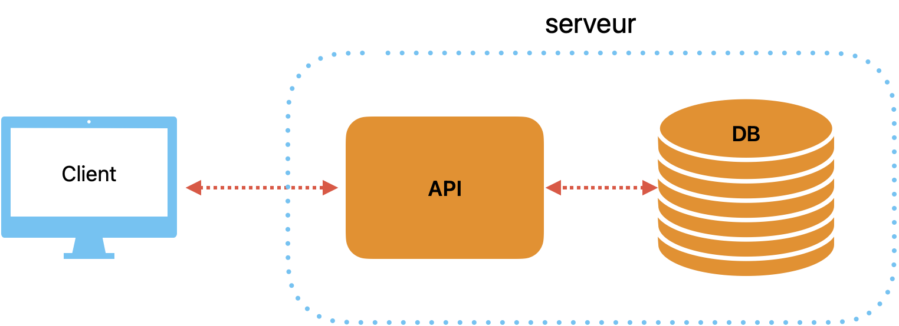

# Introduction

## Description

Pulsarly est une API de suivi de temps. Elle permet aux étudiants, aux professionnels, aux freelancers et autres de déterminer le temps passé sur leur travail. L'application permet de lancer et arrêter un chronomètre ou d'entrer manuellement un temps de travail.  Il est possible de créer des projets pour classer les tâches effectuées. 

Pour les professionnels, il est aussi possible d'entrer un montant horaire et de déterminer le prix qu'a coûté un projet afin de plus simplement facturer les clients. 

On peut générer des statistiques en fonction des projets, sur plusieurs jours, semaines, mois, etc avec diverses valeurs. Une fonctionnalité d'exportation permet d'obtenir les données au format CSV ou PDF. 

# Objectifs

## Objectifs primaires

- Démarrer et arrêter un chronomètre
- Entrer manuellement une durée de travail
- Afficher tous les chronomètres
- Filtrage sur la liste des chronomètres, selon : 
  - Projets
  - Date
  - Durée
  - Facturation
- Projets
  - Ajouter, modifier, supprimer
  - Assigner à un chronomètre
- Statistiques

## Objectifs secondaires

- Exporation des données (CSV, PDF, ...)
- Facturation
  - Prix horaire
  - Gestion des clients

# Architecture

{width=10cm}

# Planification

| **Semaine**| **Tâche**                       |
| ----------- | --------------------------------- |
| 48          | Rédaction du cahier des charges |
| 49          | Mise en place de la structure du projet |
| 50          | Implémentation |
| 51          | Implémentation |
| 52          | (Implémentation si retard) |
| 01          | Tests, corrections de bugs, fonctions secondaires |
| 02          | Rédaction du rapport              |
| 03          | Finalisations                     |

Table: Planification hebdomadaire initiale
